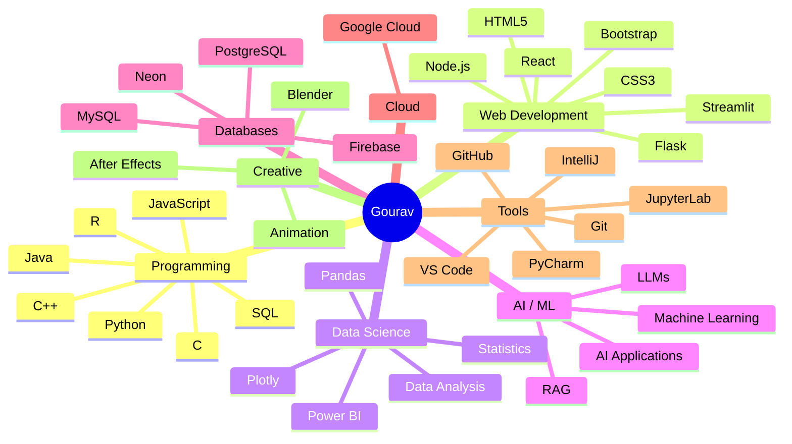

# 👋 Hi, I'm Gourav Kumar Sharma

### 🚀 Computer Science & Data Science Student | AI/ML Enthusiast | Full-Stack Developer

<p align="center">
  <a href="https://github.com/Gouravkumar532">
    
  </a>
  <a href="https://www.linkedin.com/in/gourav-sharma2k">
    
  </a>
  <a href="mailto:gourav0002006@gmail.com">
    
  </a>
</p>

---

## 🧑‍💻 About Me

🎓 I'm currently pursuing a **B.Tech in Computer Science and Engineering (Data Science)** at **Vellore Institute of Technology (VIT), Vellore**.

💡 I'm passionate about **Software Engineering, Data Science, Artificial Intelligence, Full-Stack Development, and problem solving**.

🔭 Currently exploring and building applications involving **AI/ML, data analytics, interactive dashboards, and modern web technologies**.

🧠 I enjoy turning ideas into practical software—from **data-driven applications and web platforms to AI-powered solutions**.

📚 Currently strengthening my foundations in **Data Structures & Algorithms, Data Analysis, Statistics, Object-Oriented Programming, and Software Development**.

🎨 Outside of coding, I'm also involved in **animation, 3D modeling, motion graphics, and creative digital projects** through the VIT Animation Club.

---

## 🎓 Education

### 🏛️ Vellore Institute of Technology — Vellore

**B.Tech in Computer Science & Engineering (Data Science)**
`2024 – 2028`

⭐ **CGPA: 9.33**

### 📚 Army Public School

**CBSE — Secondary & Senior Secondary**
`2012 – 2024`

* **Class X:** 97.4%
* **Class XII:** 96.6%

### 📖 Relevant Coursework

* Data Structures & Algorithms
* Foundations of Data Analysis
* Applied Statistics
* Object-Oriented Programming
* Professional Communication

---

# 💻 Tech Stack

## ⚡ Programming Languages

<p align="center">
  
  
  
  
  
  
  
</p>

## 🌐 Web Development

<p align="center">
  
  
  
  
  
  
  
  
</p>

## 🤖 Data Science & AI

<p align="center">
  
  
  
  
  
</p>

## 🗄️ Databases & Cloud

<p align="center">
  
  
  
  
  
</p>

## 🛠️ Developer Tools

<p align="center">
  
  
  
  
  
  
</p>

---

# 🚀 Featured Projects

## 📊 Energy Business Control Tower

**Python • Streamlit • PostgreSQL • Plotly • Neon**

> A full-stack supply-chain analytics platform for tracking circular-economy material flows and geographic networks.

### ✨ Highlights

* 📈 Built an interactive analytics dashboard for **16,000+ relational records**
* ⚡ Optimized data insertion pipelines using vectorized batch loading
* 🚀 Achieved an **85% reduction in network latency**
* 🔎 Implemented compound multi-select filtering
* 🌊 Created dynamic **Plotly Sankey diagrams** for material-flow visualization
* 💾 Added cached data states for fast dashboard rendering
* 📥 Built an asynchronous report-export engine for filtered operational data

---

## 🎮 Retro Game Hub

**HTML5 • CSS • JavaScript • Firebase**

> A browser-based gaming platform featuring classic retro games, authentication, real-time synchronization, and global leaderboards.

### ✨ Highlights

* 🕹️ Developed games using **HTML5 Canvas + Vanilla JavaScript**
* 🔐 Integrated Firebase authentication
* 🔄 Implemented real-time data synchronization
* 🏆 Built a global leaderboard system
* 🌐 Designed a complete interactive web platform

---

# 🧠 Currently Learning

```text
                 ┌──────────────────────────┐
                 │       MY LEARNING        │
                 └────────────┬─────────────┘
                              │
       ┌──────────────────────┼──────────────────────┐
       ▼                      ▼                      ▼
   Algorithms               AI / ML             Full Stack
       │                      │                      │
       ├─ DSA                 ├─ ML                  ├─ React
       ├─ Problem Solving     ├─ LLMs                ├─ Node.js
       └─ Optimization        └─ RAG                 └─ Flask
                              │
                              ▼
                       Data Science
                              │
                     ┌────────┼────────┐
                     ▼        ▼        ▼
                   Pandas  Statistics  SQL
```

---

# 🗺️ How My Stack Fits Together



---

# 🏆 Certifications & Learning

* 📚 **The Ultimate Job Ready Data Science Course** — 22 Sub-courses *(Ongoing)*
* 🌐 **CS50 Web Programming**

---

# 🎨 Leadership & Extracurricular

## 🎬 VIT Animation Club

**Member • March 2025 – Present**

* 🎞️ Contributed to the production of **3 short animated projects**
* 🧊 Worked with **Blender and Adobe After Effects**
* 🎨 Participated in character rigging, 3D modeling, and motion graphics
* 🧑‍🏫 Co-facilitated bi-weekly workshops on storyboarding and 2D frame-by-frame animation
* 👥 Helped upskill an active community of **30+ student members**
* 📱 Designed promotional content for social media
* 🎪 Assisted with the club's annual digital arts showcase

---

# 📊 GitHub Stats

<div align="center">


</div>

<br/>

<div align="center">


</div>

---

# 📫 Let's Connect

<div align="center">

### 💬 I'm always interested in building, learning, and collaborating.

<a href="https://github.com/Gouravkumar532">
  
</a>

<a href="https://www.linkedin.com/in/gourav-sharma2k">
  
</a>

<a href="mailto:gourav0002006@gmail.com">
  
</a>

</div>

---

<div align="center">

### ⭐ If you find my projects interesting, feel free to explore my repositories!

**"Build. Learn. Experiment. Repeat."**

</div>
